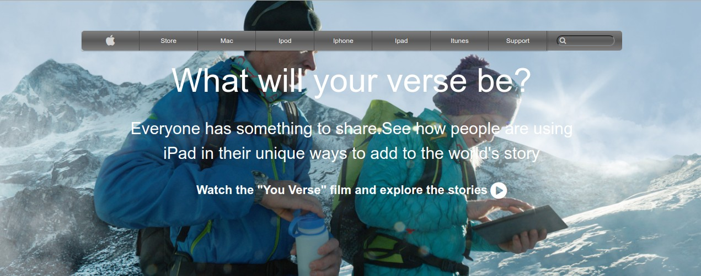

# apple-page
Clone of an Apple Page

## Table of Contents

* [About the Project](#about-the-project)
  * [Built With](#built-with)
* [Contributing](#contributing)
* [Contact](#contact)
* [Acknowledgements](#acknowledgements)

<!-- ABOUT THE PROJECT -->
## About The Project

URL to the live version of my project: [Apple Page](https://raw.githack.com/mcastorena0316/apple-page/master/index.html)

This a rebuild from an Apple Page. The page we use for reference is [Apple](https://web.archive.org/web/20140301004610/http://www.apple.com/)

### Built With

* [HTML](https://github.com/mcastorena0316/apple-page/blob/feature-branch/index.html)
* [CSS](https://github.com/mcastorena0316/apple-page/blob/feature-branch/style.css)

## Contributing

Contributions are what make the open source community such an amazing place to be learn, inspire, and create. Any contributions you make are **greatly appreciated**.

1. Fork the Project
2. Create your Feature Branch (`git checkout -b feature/AmazingFeature`)
3. Commit your Changes (`git commit -m 'Add some AmazingFeature'`)
4. Push to the Branch (`git push origin feature/AmazingFeature`)
5. Open a Pull Request

<!-- CONTACT -->
## Contact

Melissa Castorena - mcastorena0316@gmail.com

Project Link: [Apple](https://github.com/mcastorena0316/apple-page/tree/feature-branch)

<!-- ACKNOWLEDGEMENTS -->
## Acknowledgements

* [Microverse](https://www.microverse.org/)
* [Apple](https://www.apple.com/)

